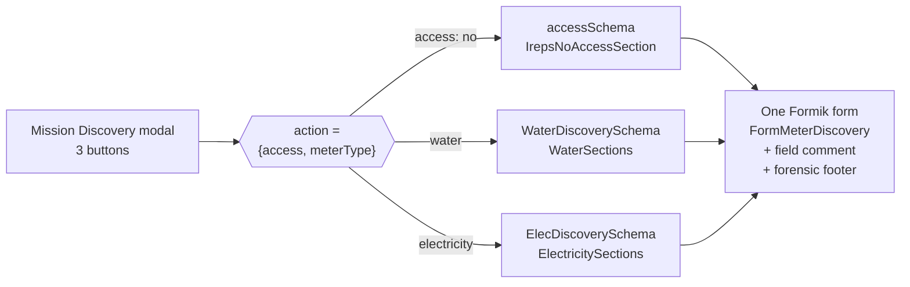
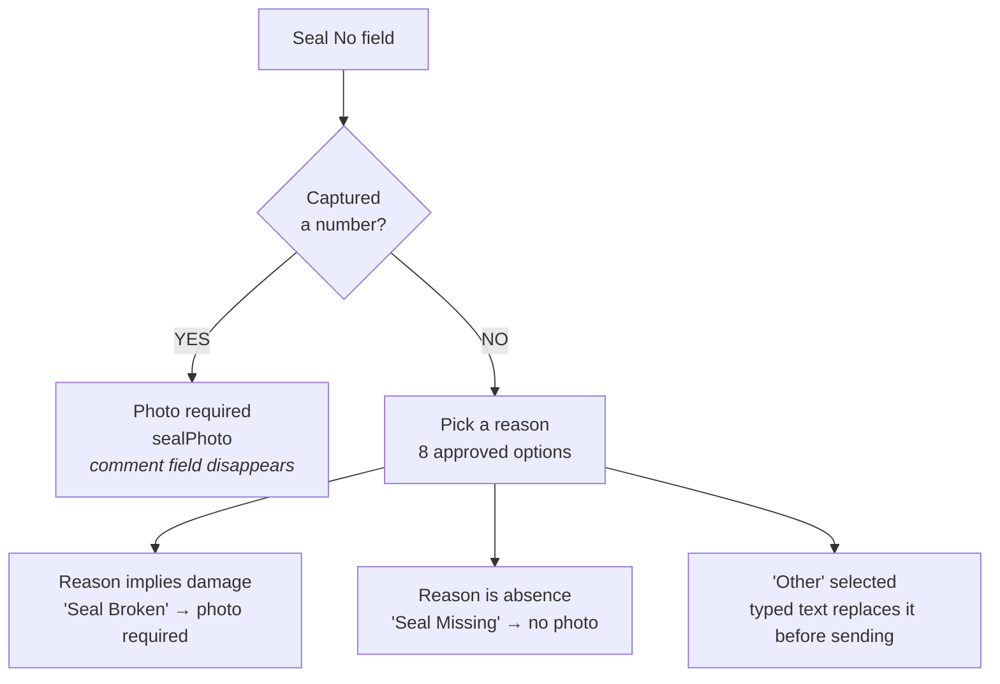
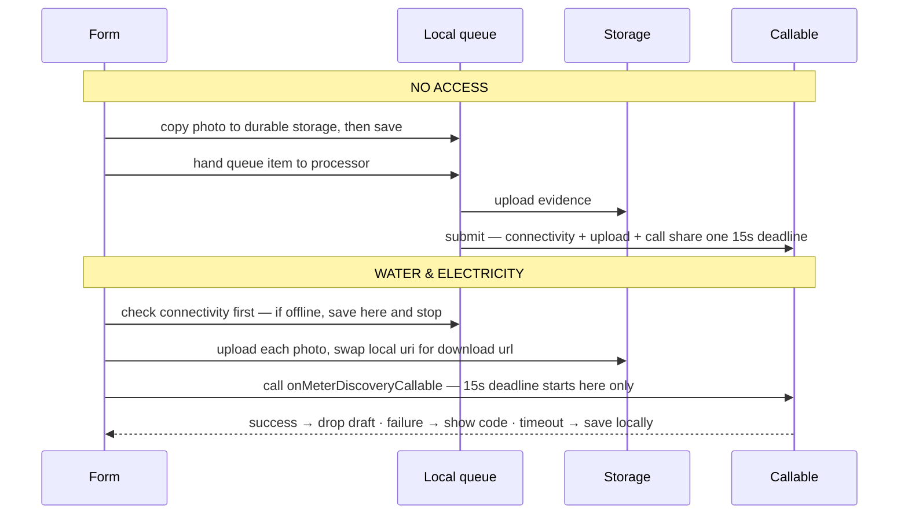
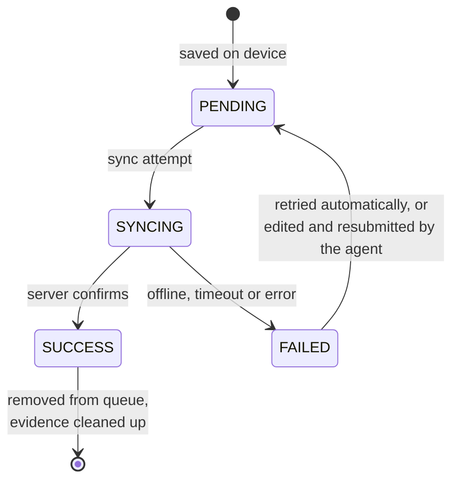
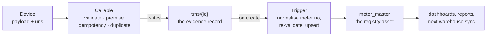

# Meter Discovery — Design & Field Reference

**Module:** IREPS Mobile · Field Operations
**Form:** `src/features/meters/FormMeterDiscovery.js`
**Transaction type:** `METER_DISCOVERY` · id prefix `TRN_MDIS_`
**Contract version:** 2
**Audience:** field agents and developers
**Compiled from source:** September 2026

> Rendered version of this document: `meter-discovery-design.html` (same folder).

---

## Contents

1. [What Meter Discovery is, and why it exists](#1-what-meter-discovery-is-and-why-it-exists)
2. [One form, three missions](#2-one-form-three-missions)
3. [What must be true before the form opens](#3-what-must-be-true-before-the-form-opens)
4. [Field inventory — No Access](#4-field-inventory--no-access)
5. [Field inventory — Water](#5-field-inventory--water)
6. [Field inventory — Electricity](#6-field-inventory--electricity)
7. [The value-or-excuse contract](#7-the-value-or-excuse-contract)
8. [Evidence: what a photograph carries](#8-evidence-what-a-photograph-carries)
9. [Validation happens twice](#9-validation-happens-twice-deliberately)
10. [What happens when the agent taps Submit](#10-what-happens-when-the-agent-taps-submit)
11. [Online and offline](#11-online-and-offline)
12. [After submit: how it becomes a registry asset](#12-after-submit-how-it-becomes-a-registry-asset)
13. [Known gaps](#13-known-gaps)
14. [Developer notes](#14-developer-notes)

---

## 1. What Meter Discovery is, and why it exists

A municipality bills for electricity and water it can only partly see. Meters get installed, replaced, bypassed and forgotten; the registry drifts from reality. Meter Discovery is the fieldwork that closes that gap, one premise at a time.

An agent stands at a property, finds the meter, and records what is physically there: its number, make, model, phase, category, seal, keypad, circuit breaker, reading, credit, condition and exact position. Every claim that matters is backed by a photograph stamped with GPS coordinates, the agent's name and the moment of capture.

That last part is the whole point. The output of this form is not a data entry — it is **evidence**. A discovered meter can trigger a bill, a disconnection, or a tamper investigation, and any of those can be disputed. So the form is built to make an unsupported claim difficult to submit: if you say the seal is broken, the form wants the photograph before it will let you go.

Every submission becomes a transaction — a `TRN` — with an id shaped like:

```
TRN_MDIS_1725712800000_ELC_WD52001_14302
         └timestamp──┘ └type └ward──┘ └erf┘
```

That id is generated on the device the moment the form opens, and it is what makes the whole offline story possible.

### What a discovery is not

It is not *Meter Installation* (that is `TRN_MINST_`, a separate form for meters the agent puts in themselves), and it is not a meter reading round. Discovery answers one question: **what is here right now, and can you prove it?**

---

## 2. One form, three missions

Meter Discovery looks like a single screen, but it is three different forms sharing one file. Which one you get is decided before the screen opens, and cannot be changed afterwards.

Tapping a premise raises the **Mission Discovery** modal with three buttons. The choice writes an `action` parameter into the route, and the form reads that parameter to pick its field set, its validation schema and its entire behaviour.

| Mission | `meterType` | Schema | Renders | Scale |
|---|---|---|---|---|
| **NO ACCESS** | `"NA"` | `accessSchema` | `IrepsNoAccessSection` | 4 inputs |
| **WATER** | `"water"` | `WaterDiscoverySchema` | `WaterSections` | ~15 inputs |
| **ELECTRICITY** | `"electricity"` | `ElecDiscoverySchema` | `ElectricitySections` | ~28 inputs |



**The mission is chosen before the form renders.** One route parameter selects the validation schema and the section component together — there is no in-form toggle between water and electricity, and no way to convert a No Access into a capture. Backing out and re-entering through the modal is the only way to change mission.

---

## 3. What must be true before the form opens

Four preconditions. If any fails the agent sees a spinner or an alert rather than a form.

### 1 · A premise must resolve

The form is handed a `premiseId` and looks it up in the offline warehouse first. If the premise is not there — typically because it was captured minutes ago and has not synced — it falls back to the MMKV premise draft queue. If neither returns anything, the screen holds on *"Loading premise…"*.

The premise supplies the erf number, address, property type and the full geographic parent chain (`countryPcode`, `provincePcode`, `dmPcode`, `lmPcode`, `wardPcode`), all of which are stamped onto the transaction.

### 2 · Location permission must be granted

On mount the form requests foreground location and starts a continuous watch — updating every metre of movement or every five seconds. Refusing permission raises *"Location is required for forensic evidence"*. Without it, photographs cannot be stamped and the GPS field cannot be satisfied.

### 3 · A mission must be selected

As described above — the modal, not the form, makes this choice.

### 4 · In edit mode, the draft must load

Re-opening a queued draft passes a `queueItemId`. The form shows *"Loading draft…"* and then either rehydrates the saved values or reports *"Draft not found."*

Rehydration is not a plain load: stored canonical values are unpacked back into their editable form, so a manufacturer saved as `"Siemens"` reappears as **Other** plus a text box containing *Siemens*.

> ### ⚠ The premise gate is checked again at submit
>
> Opening the form does not mean you can submit it. If the parent premise is still an unsynced local draft, the meter transaction is refused at submit time and saved as a draft instead — a meter cannot exist before the property it sits on. The work is never discarded, only deferred.

---

## 4. Field inventory — No Access

`meterType: "NA"`

The smallest mission. The agent is proving a negative — that they attended and could not reach the meter — so the evidence requirement matters more than the data.

| Field | Path | Control | Options & rules | Required |
|---|---|---|---|---|
| **NA Reason** | `accessData.access.reason` | Modal radio list | Property Locked · Access Refused by Occupant · Unsafe / Dangerous Environment · Meter Box Inaccessible · Meter Obstructed · Property Demolished · Property Vacant · Other | Always |
| **Other reason** | stored as `"Other: <text>"` | Text input | Free text. A bare `Other` with no detail is rejected — the reason is only complete once the text is filled in. | If reason = Other |
| **No Access photo** | `media[tag=noAccessPhoto]` | Camera | GPS + agent + timestamp stamped into the image at capture. | Once reason set |
| **Field comment** | `fieldComment.text` | Text area | Free text, plus optional photo, voice note or video. | Optional |

Everything else is system-set: `hasAccess: "no"`, `meterType: "NA"`, `ast: null`, and a generated `TRN_MDIS_…_NA_…` id. There is no asset record, because no asset was seen.

---

## 5. Field inventory — Water

`meterType: "water"`

Water records the meter, one reading, and its condition. It has no seal, keypad, circuit breaker, phase, placement or normalisation — those are electricity concerns.

### Meter description

| Field | Path | Control | Options & rules | Required |
|---|---|---|---|---|
| **Meter Number** | `ast.astData.astNo` | Text + barcode scan | Trimmed and upper-cased on entry. Above 3 characters the app checks the offline warehouse and raises *"Duplicate meter detected"* naming the address it is already linked to, then clears the field. | Always |
| **Category** | `…meter.category` | Select | Normal · Bulk *(defaults to Normal)* | Always |
| **Type** | `…meter.type` | Select | Prepaid · Conventional *(defaults to Conventional)*. Switching to Conventional clears any captured Remaining Credit and deletes its photo. | Always |
| **Manufacturer** | `ast.astData.astManufacturer` | Select | Conlog · Sensus · Elster Kent · Itron · Kamstrup · Lesira Teq · Aqua Loc · Reonet · Other | Always |
| **Model Name** | `ast.astData.astName` | Text | Free text. | Always |

### Reading — one or the other, never both

| Field | Path | Control | Options & rules | Required |
|---|---|---|---|---|
| **Meter Reading** | `ast.meterReading` | Numeric | Digits only. Becomes an `mreadings[]` entry tagged `AST_CREATION` on submit. | If Conventional |
| **Token Reading** | `ast.tokenReading` | Numeric | Digits only. Becomes a `treadings[]` entry tagged `AST_CREATION`. | If Prepaid |
| **Reading photo** | `meterReadingPhoto` / `tokenReadingPhoto` | Camera | Appears as soon as a reading is typed. The server requires it unconditionally. | Always |

### Remaining credit — prepaid only

| Field | Path | Control | Options & rules | Required |
|---|---|---|---|---|
| **Remaining Credit** | `…meter.remainingCredit` | Numeric | Signed decimal, `/^[+-]?\d+(\.\d+)?$/`. Negative values are legitimate. | Value or reason |
| **Reason not captured** | `…remainingCreditComment` | Select | Display blank / no reading · Display damaged · Display unreadable · Unable to obtain balance · Meter not responding · Other | If no value |
| **Other reason** | `…remainingCreditCommentOther` | Text | Merged to `"Other: <text>"` before transmission. | If reason = Other |
| **Credit photo** | `media[remainingCreditPhoto]` | Camera | Required when a value is captured; automatically deleted if the value is cleared. | If value captured |

### Status, condition and position

| Field | Path | Control | Options & rules | Required |
|---|---|---|---|---|
| **Meter Status** | `status.state` | Select | Connected · Disconnected | Always |
| **Anomaly** | `ast.anomalies.anomaly` | Select | Meter Ok · Meter Faulty · Meter Damaged · Illegally Connected | Always |
| **Anomaly Detail** | `ast.anomalies.anomalyDetail` | Dependent select | Options filtered by the anomaly chosen. Selecting *Meter Ok* auto-fills *Operationally Ok* and locks the control. | Always |
| **Anomaly photo** | `media[anomalyPhoto]` | Camera | Demanded for every anomaly except *Meter Ok*. | If not Meter Ok |
| **Other Anomaly** | `…anomalies.otherAnomalies` | Checkboxes | Meter Blocked (By Munic) · Meter Bridged (By Munic) · Incomplete Service Points · Meter Not Registered · Keypad Faulty. Duplicates rejected. | Optional |
| **Meter GPS** | `ast.location.gps` | Map picker | Opens on the erf boundary with nearby erfs, premises and meters drawn within 120 m. Must be finite, in range, and not `0,0`. | Always |
| **Field comment** | `fieldComment.text` | Text area | Free text, plus optional photo, voice or video. | Optional |

### Anomaly detail options

| Anomaly | Details |
|---|---|
| Meter Ok | Operationally Ok *(auto-selected, locked)* |
| Meter Faulty | Not Accepting Sgc Tokens · Meter Display Blank · Negative Credit Units · Zero Reading - Conventional Meter · Meter Wheel Not Moving · Meter Wheel Running In Reverse |
| Meter Damaged | Meter Number Not Clearly Visible · Meter Burnt · Meter Button(s) Not Working · Meter Broken |
| Illegally Connected | Straight Connection (Meter Bypassed) · Bridge Wire On The Meter |

---

## 6. Field inventory — Electricity

`meterType: "electricity"`

The full set. Everything water has, minus the readings, plus phase, the three infrastructure blocks, placement, off-grid supply and normalisation.

### Core meter data

| Field | Path | Control | Options & rules | Required |
|---|---|---|---|---|
| **Meter Number** | `ast.astData.astNo` | Text + barcode scan | Upper-cased, duplicate-checked against the warehouse. Pre-filled when the agent arrives from a targeted batch. | Always |
| **Manufacturer** | `ast.astData.astManufacturer` | Select | Conlog · Landis+gyr · Cashpower · Hexing · Powercom · Itron · Other | Always |
| **Other Manufacturer** | `…astManufacturerOther` | Text | Appears only when *Other* is chosen. Replaces the manufacturer value entirely before transmission. | If Other |
| **Model (Name)** | `ast.astData.astName` | Text | Becomes required as soon as a manufacturer is chosen. | Always |
| **Phase** | `…meter.phase` | Select | Single · Three | Always |
| **Type** | `…meter.type` | Select | Prepaid · Conventional. Master switch: reveals the keypad block and the remaining-credit block; switching away clears both. | Always |
| **Category** | `…meter.category` | Select | Normal · Bulk | Always |

### Remaining credit — prepaid only

Identical contract to water: a value plus a photo, or a reason. Capturing a value clears the reason; clearing the value deletes the photo.

### Infrastructure — each is a value-or-excuse block

| Field | Path | Control | Options & rules | Required |
|---|---|---|---|---|
| **Seal No** | `…meter.seal.sealNo` | Text + barcode scan | Scanning prompt: *"Align Seal Barcode"*. | Number **or** comment |
| **Seal Comment** | `…seal.comment` | Select | Seal Missing · **Seal Broken** · **Seal Damaged** · **Seal Number Not Visible** · **Seal Number Unreadable** · Seal Removed · **Meter Not Sealed** · Other | If no number |
| **Seal Other reason** | `…seal.commentOther` | Text | Replaces the comment value before transmission. | If comment = Other |
| **Keypad Serial No** | `…meter.keypad.serialNo` | Text + barcode scan | Whole block appears only for prepaid meters. | Prepaid, optional |
| **Keypad Comment** | `…keypad.comment` | Select | Keypad Missing · Keypad Not Installed · **Keypad Integrated With Meter** · **Serial Number Not Visible** · **Serial Number Unreadable** · **Keypad Damaged** · Keypad Inaccessible · Other | If no serial |
| **Keypad Other reason** | `…keypad.commentOther` | Text | Free text. | If comment = Other |
| **CB Size (Amps)** | `…meter.cb.size` | Numeric | Circuit breaker rating. | Optional |
| **CB Comment** | `…cb.comment` | Select | Circuit Breaker Missing · **Size Not Visible** · **Size Unreadable** · **Circuit Breaker Damaged** · Circuit Breaker Inaccessible · No Dedicated Circuit Breaker · Distribution Board Inaccessible · Other | If no size |
| **CB Other reason** | `…cb.commentOther` | Text | Free text. | If comment = Other |

**Bold reasons force a photo.** See [section 7](#7-the-value-or-excuse-contract).

### Location

| Field | Path | Control | Options & rules | Required |
|---|---|---|---|---|
| **Meter Placement** | `ast.location.placement` | Select | Kiosk · Pole Top · Pole Bottom · Boundary Wall · Meter Room · Wall Indoors · Inside Property · Other | Always |
| **Meter GPS** | `ast.location.gps` | Map picker | Erf boundary with 120 m neighbourhood context. Rejects `0,0` and out-of-range coordinates. | Always |

### Status and supply

| Field | Path | Control | Options & rules | Required |
|---|---|---|---|---|
| **Meter Status** | `status.state` | Select | Connected · Disconnected | Always |
| **Off-Grid Supply?** | `ast.ogs.hasOffGridSupply` | Select | Yes · No *(defaults to No)*. Solar or generator supply at the property. | Always |
| **Off-grid photo** | `media[ogsPhoto]` | Camera | Appears and is demanded when Yes is selected. | If Yes |

### Condition

Anomaly, Anomaly Detail, Anomaly photo and Other Anomaly behave exactly as in [water](#5-field-inventory--water).

### Normalisation — what the agent fixed on site

| Field | Path | Control | Options & rules | Required |
|---|---|---|---|---|
| **Actions Taken** | `ast.normalisation.actionTaken` | Checkboxes (multi) | None · New Meter Installed · Meter Removed · Illegal connection – meter disconnected · Illegal connection – meter reconnected · Meter faulty – meter replaced · Meter damaged – meter replaced · Tamper Removed · Keypad Normalised · Service Point Completed / Cable Installed · Meter Registered | Always |
| **Normalisation photo** | `media[normalisationPhoto]` | Camera | Demanded as soon as any action other than *None* is ticked. | If any action |
| **Field comment** | `fieldComment.text` | Text area | Free text, plus optional photo, voice or video. | Optional |

**At least one action must be selected. `None` is exclusive** — ticking it clears everything else, and unticking the last real action forces it back. Duplicates are rejected.

---

## 7. The value-or-excuse contract

This one pattern governs the **seal**, the **keypad**, the **circuit breaker** and the **remaining credit**. Understand it once and four sections of the form become obvious.

The problem it solves: a field agent genuinely cannot always read a seal number. The seal may be missing, painted over, behind a locked box. A form that simply demands the number invites invention. A form that accepts a blank invites laziness. So the form accepts either — but never nothing.



**Either the value or an approved reason — and the reason decides whether a photo follows.** Which reasons demand evidence is data, not code: each option carries a `photoRequired` flag in `formOptions.js`, and the same flags are re-declared on the server in `validation.js`. Reasons describing damage need proof; reasons describing absence do not.

### The three blocks are not equally strict

- **Seal** is mandatory — a number or a comment, one of them, always.
- **Keypad** and **circuit breaker** are optional: leaving both blank passes. But if you start answering, you must answer properly.

### "Other" never reaches the database

On submit, every `Other` plus its free text collapses into a single canonical value. A seal comment of *Other* with the text *"welded shut"* is transmitted as `"welded shut"`; the helper field is deleted.

Remaining credit is the exception — it keeps an `"Other: "` prefix so the reason stays distinguishable from the approved list. The server rejects a literal `"Other"` outright.

---

## 8. Evidence: what a photograph carries

Photographs are not attachments. Each one is captured through the app's own camera, which renders a watermark into the image and records a structured object alongside it:

```js
{
  tag: "sealPhoto",              // which requirement it satisfies
  uri: "file:///…",              // local until uploaded
  url: null,                     // Firebase Storage URL after sync
  type: "image",
  gps: { lat, lng },             // live device fix, falling back to the erf centroid
  created: { at, byUser, byUid },
  updated: { at, byUser, byUid }
}
```

The `tag` is what validation looks for — rules never ask "is there a photo", they ask "is there a photo tagged `sealPhoto` with a usable URI". One photo per tag: re-shooting replaces rather than appends.

### The eleven evidence slots

| Tag | Mission | Demanded when |
|---|---|---|
| `noAccessPhoto` | NA | A no-access reason has been chosen |
| `astNoPhoto` | Water · Elec | A meter number has been entered |
| `meterReadingPhoto` | Water | Conventional, reading entered |
| `tokenReadingPhoto` | Water | Prepaid, token reading entered |
| `remainingCreditPhoto` | Water · Elec | Prepaid, a credit value was captured |
| `sealPhoto` | Elec | Seal number entered, or a damage reason chosen |
| `keypadPhoto` | Elec | Prepaid, serial entered or a damage reason chosen |
| `astCbPhoto` | Elec | CB size entered, or a damage reason chosen |
| `ogsPhoto` | Elec | Off-grid supply is Yes |
| `anomalyPhoto` | Water · Elec | Any anomaly other than Meter Ok |
| `normalisationPhoto` | Elec | Any normalisation action other than None |

The field comment carries three more optional slots — `fieldCommentPhoto`, `fieldCommentVoice` and `fieldCommentVideo` — which are never required.

---

## 9. Validation happens twice, deliberately

Every rule in the form is written twice: once in the app so the agent gets an immediate red field, and once on the server so a modified or stale client cannot bypass it.

### Layer 1 — on the device

Yup schemas, validated on mount and on every change, so the form is red from the moment it opens and turns green only when genuinely complete. The submit button is the status display: **red cross** while anything is outstanding, **green tick** when the form is valid *and* has been touched.

> **A quirk worth knowing.** The button requires Formik's `dirty` flag, so a rehydrated draft that is already complete still shows red until something is changed. Touch any field to release it.

### Layer 2 — on the server

`onMeterDiscoveryCallable` re-runs the whole rule set from `functions/meterDiscovery/validation.js`, keyed to `meterDiscoveryContractVersion: 2`. It returns a structured failure rather than throwing — a code and a message the app shows directly.

Beyond mirroring the client, the server adds four gates the device cannot enforce:

| Gate | Behaviour |
|---|---|
| **Authentication** | Unsigned callers are rejected outright. The server overwrites the submitted metadata with its own view of who the caller is. |
| **Premise existence** | The parent premise must exist in Firestore. `INVALID_PREMISE_ID` or `PREMISE_NOT_FOUND`. |
| **Idempotency** | If the transaction id already exists it returns *success*, not an error — so a retry after a lost response can never double-write. |
| **Duplicate meter** | The meter number is normalised and checked against `meter_master`. A genuine clash returns a conflict code the agent sees as *"Duplicate Meter"*. |

That duplicate check is the second of two. The app already warns locally the moment a meter number is typed, comparing against the offline warehouse — but the warehouse may be hours stale, so the server holds the authoritative answer.

---

## 10. What happens when the agent taps Submit

Two different journeys with two different guarantees. No Access is protected before anything else happens; a captured meter follows the conventional path.



**The difference is what the deadline covers.** A No Access is written to the local queue with its evidence copied to durable storage *before* any network attempt, so the fifteen seconds cover connectivity, upload and call together — nothing is lost if the clock runs out. A captured meter uploads first and starts its deadline only at the backend call, so a slow upload cannot trip it.

### The outcomes an agent can see

| Outcome | Meaning |
|---|---|
| **MISSION SUCCESS** | Confirmed by the server. Green tick modal, then back to the premise list after two seconds. |
| **Saved as Draft** | The parent premise has not synced yet. Held locally until it does. |
| **Saved Offline** | No connection. Queued and synced automatically later. |
| **Saved Locally** | Online, but no answer within fifteen seconds. Queued for retry. |
| **Duplicate Meter** | The meter number already belongs to another record. Nothing is saved — correct the number. |
| **Submission Failed** | A validation code from the server, shown verbatim. Nothing is saved. |
| **Draft Save Failed** | Local storage itself failed. Rare and serious — the work is at risk. |

> ### ⚠ Failure and offline are treated differently on purpose
>
> A *rejection* means the data is wrong, so queueing it would only replay the same rejection forever — the agent must fix it now. A *timeout* or a missing connection says nothing about the data, so it is kept and retried.
>
> Only the No Access path is persisted before the attempt; that mission is the one most often captured in exactly the places with no signal.

---

## 11. Online and offline

Agents work in basements, rural wards and steel meter rooms. The form assumes the network is absent and treats every successful sync as a bonus.

Three things make this work:

1. **The transaction id is generated on the device** when the form opens, so an offline submission already owns its final identity — which is what lets the server treat a replay as success rather than a duplicate.
2. **The warehouse** holds premises, erfs, meters and boundaries locally, so the map, the neighbourhood context and the duplicate warning all work with no signal.
3. **The submission queue** in MMKV holds anything that could not be sent.



**Nothing leaves the queue until the server has confirmed it.** Only a genuine success removes the item and cleans up its stored evidence; every other ending keeps the work on the device with its attempt history intact.

### What differs offline

- **Photographs stay on the device** as local file URIs and upload only at sync time. No Access evidence is additionally copied into a dedicated app directory (`ireps/submission-media/meter-discovery-no-access/`) so it survives the OS clearing its caches.
- **The duplicate check is local only** — the authoritative check runs when the queue drains, so a duplicate can surface hours after capture.
- **The map still works.** Boundaries and neighbourhood context come from the warehouse.
- **One sync at a time.** A second attempt while one is running is refused with `QUEUE_BUSY` and rescheduled.

---

## 12. After submit: how it becomes a registry asset

A successful submission writes a document to `trns`. That write fires a trigger, and the trigger is what turns a transaction into a meter the rest of the system can see.



**The transaction is the evidence; the master record is the asset.** The trigger only runs for submissions with access and a real asset (`hasAccess === "yes"` and `ast` present), so a No Access transaction is preserved as proof of the visit without ever creating a meter.

### How the agent gets the information back

- **Immediately** — the success modal, or a named failure. The queue screen shows anything still outstanding, with its status and attempt count.
- **On the next warehouse sync** — the discovered meter appears in the local dataset, so it shows on the map, counts toward premise statistics, and will itself trigger the duplicate warning for anyone who tries to discover it again.
- **In the back office** — the web application reads the same transactions for registries, dashboards and activity reports, where discoveries are counted per agent.

---

## 13. Known gaps

Two things found while documenting the form that are worth acting on rather than describing.

### 🐞 A water meter with an "Other" manufacturer cannot be submitted

The water manufacturer list offers *Other*, but `WaterSections` renders no follow-up text box, and the submit-time canonicalisation in `buildCanonicalMeterDiscoveryAst` runs only when `meterType === "electricity"`. The literal string `"Other"` is therefore transmitted — and the server rejects exactly that with `NON_CANONICAL_MANUFACTURER_OTHER`.

An agent who meets a water meter from an unlisted manufacturer has no way through: the field passes client validation and fails on the server every time, including on retry from the queue.

**Fix:** give water the same *Other* text input and canonicalisation electricity already has.

### ⚠ The submit-timeout comment does not match the code

The block comment above the submit path describes a thirty-second fallback, while the implementation passes `15000` throughout. The behaviour is fifteen seconds; the comment is stale. Worth correcting before someone tunes the wrong number.

---

## 14. Developer notes

### Where the code lives

**Mobile — the form**

| Path | Purpose |
|---|---|
| `src/features/meters/FormMeterDiscovery.js` | Schemas, initial values, submit — 2,528 lines |
| `src/features/meters/formOptions.js` | Every option list and `photoRequired` flag |
| `src/features/meters/noAccessReasons.js` | The eight NA reasons |
| `src/features/meters/remainingCreditContract.js` | Hydrate / canonicalise / validate |
| `src/features/meters/FormInputMeterNo.js` | Scanner + local duplicate warning |
| `src/features/meters/ForensicFooter.js` | Submit state, reset guard |

**Mobile — sections and controls**

| Path | Purpose |
|---|---|
| `components/forms/ElectricitySections.js` | Shared with Meter Installation |
| `components/forms/WaterSections.js` | Water field set |
| `components/forms/IrepsNoAccessSection.js` | NA reason picker |
| `components/forms/RemainingCreditSection.js` | Prepaid credit block |
| `components/forms/AnomalySelect.js` · `AnomalyDetailSelect.js` · `OtherAnomalySection.js` | Anomaly cascade |
| `components/media/IrepsCamera.js` | Where the forensic media object is built |

**Mobile — entry and queue**

| Path | Purpose |
|---|---|
| `components/MissionDiscoveryModal.js` | The three-button gate |
| `app/(tabs)/premises/form.js` | Route shell |
| `src/services/processSubmissionQueue.js` | Queue drain |
| `src/utils/persistNoAccessMeterDiscoveryMedia.js` | Durable NA evidence |

**Backend** (`ireps-web`)

| Path | Purpose |
|---|---|
| `functions/meterDiscovery/validation.js` | The mirrored rule set |
| `functions/index.js` | `onMeterDiscoveryCallable`, `onMeterDiscoveryCreated` |

### Payload shape

The transmitted document is not the form state. Before sending, the form canonicalises *Other* values, strips helper fields, moves water readings into `mreadings[]` or `treadings[]`, converts every `undefined` to `null`, and stamps `meterDiscoveryContractVersion: 2`.

```js
{
  id, meterType, meterDiscoveryContractVersion: 2,
  accessData: { trnType, erfId, erfNo, parents{…}, premise{…}, access{…} },
  ast: { astData{…}, anomalies{…}, location{…}, ogs{…}, normalisation{…} } | null,
  mreadings: [], treadings: [],          // water only
  media: [ … ],
  status: { state, id, detail },
  fieldComment: { text },
  serviceProvider: { id, name },
  metadata: {…}
}
```

The service provider is resolved by walking subcontractor (`SUBC`) relationships upward until the managing contractor (`MNC`) is found, so work is always attributed to the accountable party rather than whichever subcontractor employed the agent.

### Server failure codes

Returned as `{ success: false, code, message, trnId: "NAv" }` — never thrown.

```
INVALID_TRN_ID                        INVALID_TRN_TYPE
INVALID_ACCESS_VALUE                  INVALID_METER_TYPE
INVALID_NO_ACCESS_METER_TYPE          NO_ACCESS_REASON_REQUIRED
NO_ACCESS_PHOTO_REQUIRED              MISSING_REQUIRED_FIELD
MISSING_REQUIRED_PARENT               INVALID_PREMISE_ID
PREMISE_NOT_FOUND                     INVALID_METER_GPS
INVALID_METER_CATEGORY                INVALID_METER_SUBTYPE
INVALID_METER_STATUS                  INVALID_METER_PHASE
METER_PLACEMENT_REQUIRED              INVALID_METER_PLACEMENT
METER_PHOTO_REQUIRED                  ANOMALY_PHOTO_REQUIRED
INVALID_OTHER_ANOMALY                 DUPLICATE_OTHER_ANOMALY
METER_READING_REQUIRED                METER_READING_PHOTO_REQUIRED
TOKEN_READING_REQUIRED                TOKEN_READING_PHOTO_REQUIRED
INVALID_REMAINING_CREDIT              REMAINING_CREDIT_PHOTO_REQUIRED
REMAINING_CREDIT_COMMENT_REQUIRED     REMAINING_CREDIT_COMMENT_NOT_ALLOWED
SEAL_NUMBER_OR_COMMENT_REQUIRED       SEAL_PHOTO_REQUIRED
KEYPAD_SERIAL_OR_COMMENT_REQUIRED     KEYPAD_PHOTO_REQUIRED
CB_SIZE_OR_COMMENT_REQUIRED           CB_PHOTO_REQUIRED
OFF_GRID_STATUS_REQUIRED              OFF_GRID_PHOTO_REQUIRED
NORMALISATION_ACTIONS_REQUIRED        INVALID_NORMALISATION_ACTION
DUPLICATE_NORMALISATION_ACTION        NORMALISATION_NONE_NOT_EXCLUSIVE
NON_CANONICAL_MANUFACTURER_OTHER      NON_CANONICAL_SEAL_COMMENT_OTHER
NON_CANONICAL_KEYPAD_COMMENT_OTHER    NON_CANONICAL_CB_COMMENT_OTHER
```

### Two compatibility notes

- The server still accepts two retired normalisation actions — *Meter Disconnected* and *Meter Reconnected* — so submissions queued on older builds can still drain. They are not offered in the app.
- `ElectricitySections` is shared with Meter Installation and branches on the transaction id prefix (`TRN_MINST_`). Changes there affect both forms; the `isDiscovery` prop gates the discovery-only fields.

---

*IREPS · Meter Discovery · Contract version 2*
