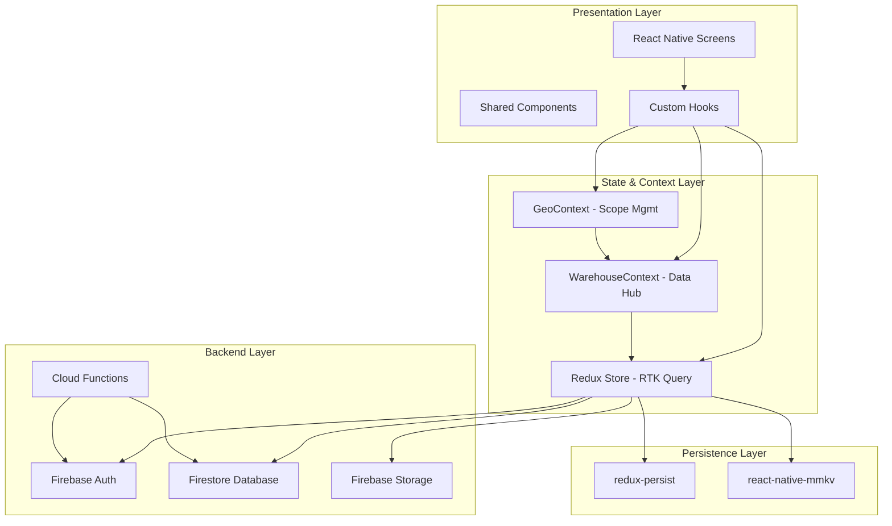

```mermaid
graph TB
    subgraph "Presentation Layer"
        UI[React Native Screens]
        COMP[Shared Components]
        HOOKS[Custom Hooks]
    end
    subgraph "State & Context Layer"
        RC[Redux Store - RTK Query]
        GC[GeoContext - Scope Mgmt]
        WC[WarehouseContext - Data Hub]
    end
    subgraph "Persistence Layer"
        RP[redux-persist]
        MMKV[react-native-mmkv]
    end
    subgraph "Backend Layer"
        FA[Firebase Auth]
        FS[Firestore Database]
        FG[Firebase Storage]
        FNC[Cloud Functions]
    end
    UI --> HOOKS
    HOOKS --> RC
    HOOKS --> GC
    HOOKS --> WC
    GC --> WC
    WC --> RC
    RC --> RP
    RC --> MMKV
    RC --> FA
    RC --> FS
    RC --> FG
    FNC --> FA
    FNC --> FS
```