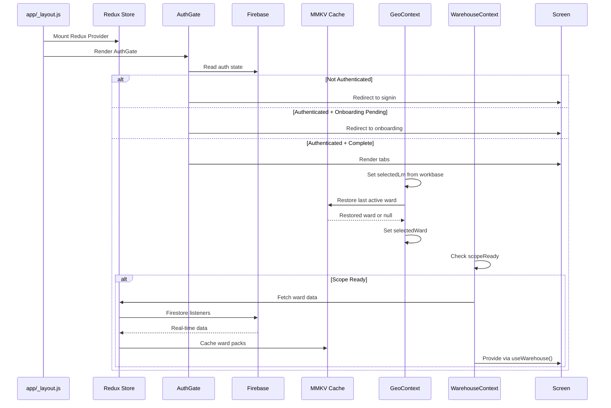

```mermaid
sequenceDiagram
    participant App as app/_layout.js
    participant Store as Redux Store
    participant AuthG as AuthGate
    participant Firebase as Firebase
    participant MMKV as MMKV Cache
    participant Geo as GeoContext
    participant WH as WarehouseContext
    participant UI as Screen

    App->>Store: Mount Redux Provider
    App->>AuthG: Render AuthGate
    AuthG->>Firebase: Read auth state
    alt Not Authenticated
        AuthG->>UI: Redirect to signin
    else Authenticated + Onboarding Pending
        AuthG->>UI: Redirect to onboarding
    else Authenticated + Complete
        AuthG->>UI: Render tabs
        Geo->>Geo: Set selectedLm from workbase
        Geo->>MMKV: Restore last active ward
        MMKV-->>Geo: Restored ward or null
        Geo->>Geo: Set selectedWard
        WH->>WH: Check scopeReady
        alt Scope Ready
            WH->>Store: Fetch ward data
            Store->>Firebase: Firestore listeners
            Firebase-->>Store: Real-time data
            Store->>MMKV: Cache ward packs
            WH->>UI: Provide via useWarehouse()
        end
    end
```