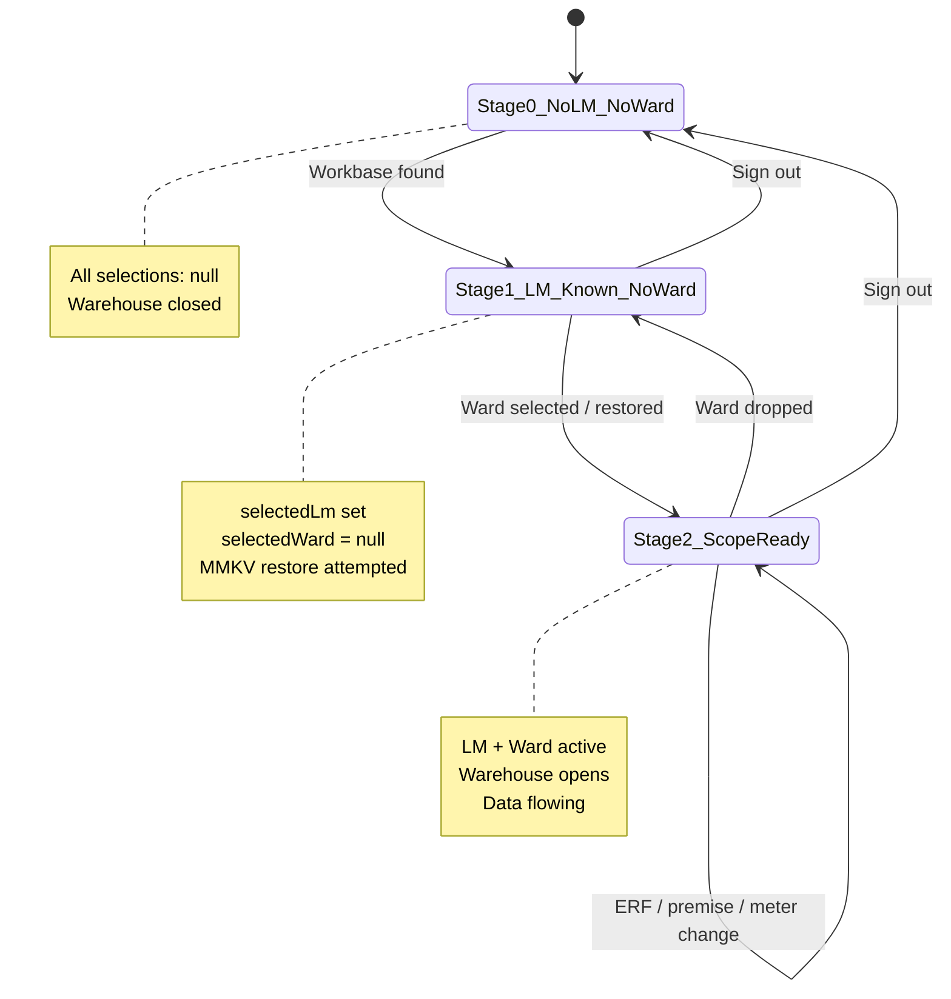

```mermaid
stateDiagram-v2
    [*] --> Stage0_NoLM_NoWard
    
    Stage0_NoLM_NoWard --> Stage1_LM_Known_NoWard: Workbase found
    
    Stage1_LM_Known_NoWard --> Stage2_ScopeReady: Ward selected / restored
    
    Stage2_ScopeReady --> Stage2_ScopeReady: ERF / premise / meter change
    
    Stage1_LM_Known_NoWard --> Stage0_NoLM_NoWard: Sign out
    
    Stage2_ScopeReady --> Stage1_LM_Known_NoWard: Ward dropped
    
    Stage2_ScopeReady --> Stage0_NoLM_NoWard: Sign out
    
    note right of Stage0_NoLM_NoWard
        All selections: null
        Warehouse closed
    end note
    
    note right of Stage1_LM_Known_NoWard
        selectedLm set
        selectedWard = null
        MMKV restore attempted
    end note
    
    note right of Stage2_ScopeReady
        LM + Ward active
        Warehouse opens
        Data flowing
    end note
```