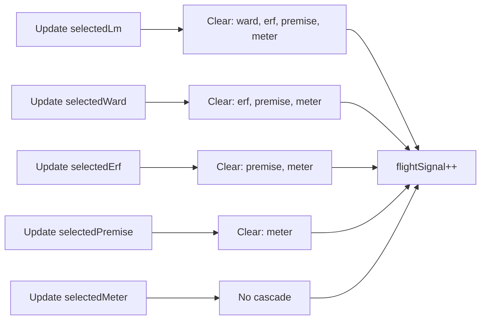

```mermaid
flowchart LR
    A["Update selectedLm"] --> B["Clear: ward, erf, premise, meter"]
    C["Update selectedWard"] --> D["Clear: erf, premise, meter"]
    E["Update selectedErf"] --> F["Clear: premise, meter"]
    G["Update selectedPremise"] --> H["Clear: meter"]
    I["Update selectedMeter"] --> J["No cascade"]
    B --> K["flightSignal++"]
    D --> K
    F --> K
    H --> K
    J --> K
```