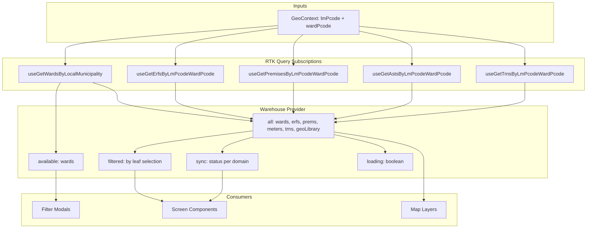

```mermaid
graph TB
    subgraph "Inputs"
        GC[GeoContext: lmPcode + wardPcode]
    end
    subgraph "RTK Query Subscriptions"
        WQ[useGetWardsByLocalMunicipality]
        EQ[useGetErfsByLmPcodeWardPcode]
        PQ[useGetPremisesByLmPcodeWardPcode]
        MQ[useGetAstsByLmPcodeWardPcode]
        TQ[useGetTrnsByLmPcodeWardPcode]
    end
    subgraph "Warehouse Provider"
        ALL[all: wards, erfs, prems, meters, trns, geoLibrary]
        AVAIL[available: wards]
        FILT[filtered: by leaf selection]
        SYNC[sync: status per domain]
        LOAD[loading: boolean]
    end
    subgraph "Consumers"
        SCREENS[Screen Components]
        FILTERS[Filter Modals]
        MAPS[Map Layers]
    end
    GC --> WQ
    GC --> EQ
    GC --> PQ
    GC --> MQ
    GC --> TQ
    WQ --> AVAIL
    WQ --> ALL
    EQ --> ALL
    PQ --> ALL
    MQ --> ALL
    TQ --> ALL
    ALL --> FILT
    ALL --> SYNC
    ALL --> LOAD
    FILT --> SCREENS
    ALL --> MAPS
    AVAIL --> FILTERS
    SYNC --> SCREENS
```