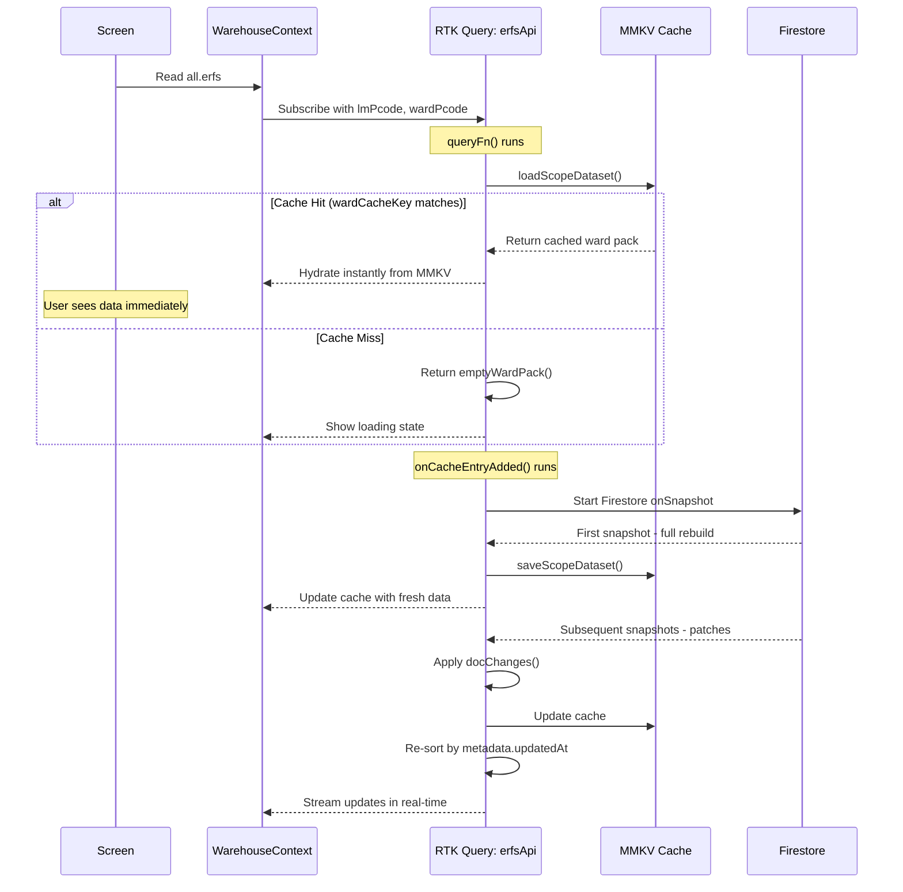

```mermaid
sequenceDiagram
    participant UI as Screen
    participant WH as WarehouseContext
    participant RQ as RTK Query: erfsApi
    participant MMKV as MMKV Cache
    participant FS as Firestore

    UI->>WH: Read all.erfs
    WH->>RQ: Subscribe with lmPcode, wardPcode
    
    Note over RQ: queryFn() runs
    RQ->>MMKV: loadScopeDataset()
    
    alt Cache Hit (wardCacheKey matches)
        MMKV-->>RQ: Return cached ward pack
        RQ-->>WH: Hydrate instantly from MMKV
        Note over UI: User sees data immediately
    else Cache Miss
        RQ->>RQ: Return emptyWardPack()
        RQ-->>WH: Show loading state
    end
    
    Note over RQ: onCacheEntryAdded() runs
    RQ->>FS: Start Firestore onSnapshot
    FS-->>RQ: First snapshot - full rebuild
    RQ->>MMKV: saveScopeDataset()
    RQ-->>WH: Update cache with fresh data
    
    FS-->>RQ: Subsequent snapshots - patches
    RQ->>RQ: Apply docChanges()
    RQ->>MMKV: Update cache
    RQ->>RQ: Re-sort by metadata.updatedAt
    RQ-->>WH: Stream updates in real-time
```