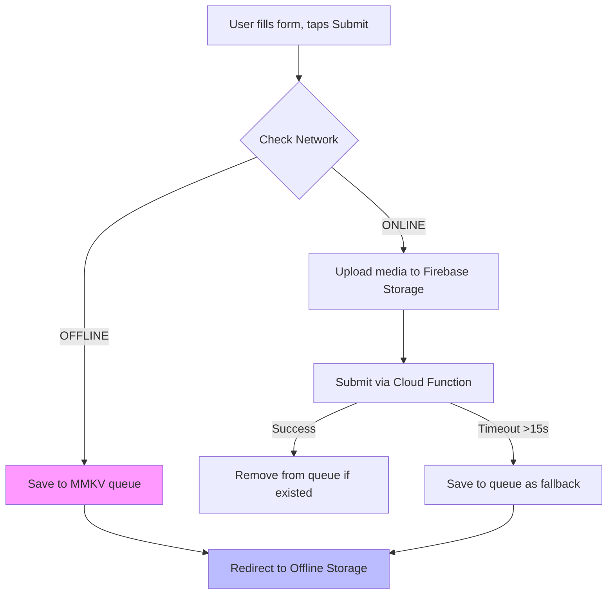

```mermaid
flowchart TD
    START[User fills form, taps Submit] --> NET{Check Network}
    
    NET -->|OFFLINE| Q_SAVE[Save to MMKV queue]
    Q_SAVE --> Q_REDIRECT[Redirect to Offline Storage]
    
    NET -->|ONLINE| MEDIA[Upload media to Firebase Storage]
    MEDIA --> POST[Submit via Cloud Function]
    POST -->|Success| CLEAN[Remove from queue if existed]
    POST -->|Timeout >15s| Q_FALLBACK[Save to queue as fallback]
    Q_FALLBACK --> Q_REDIRECT
    
    style Q_SAVE fill:#f9f
    style Q_REDIRECT fill:#bbf
```